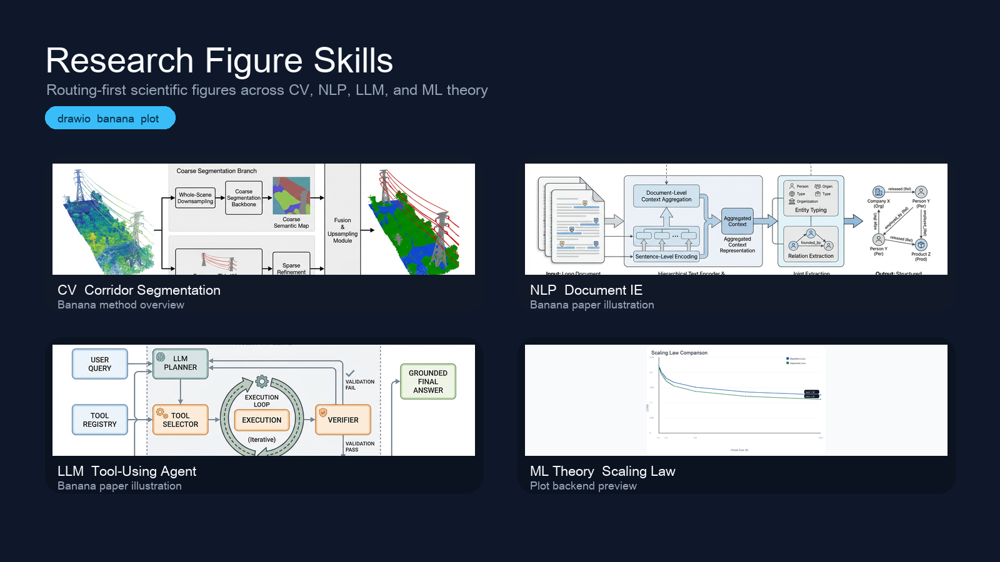
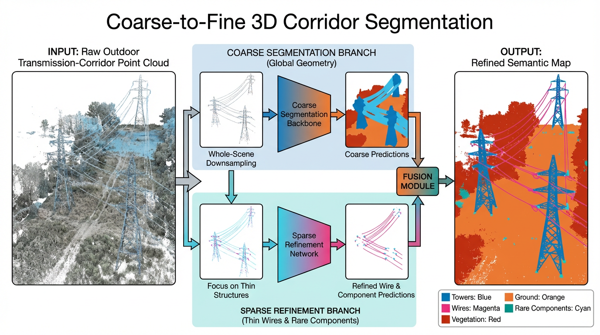
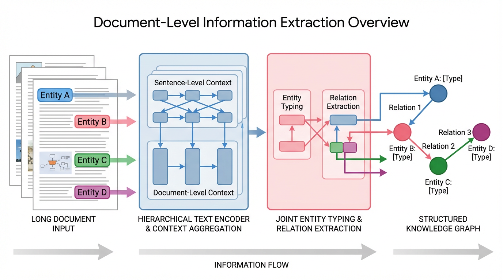
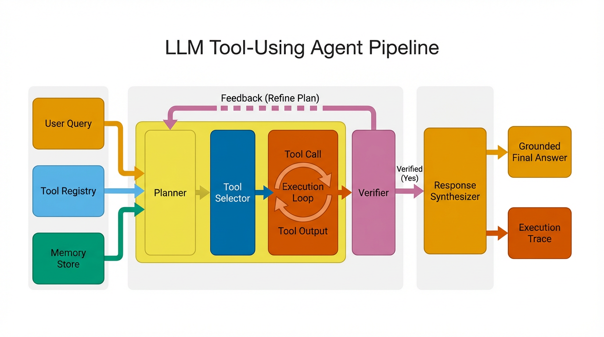
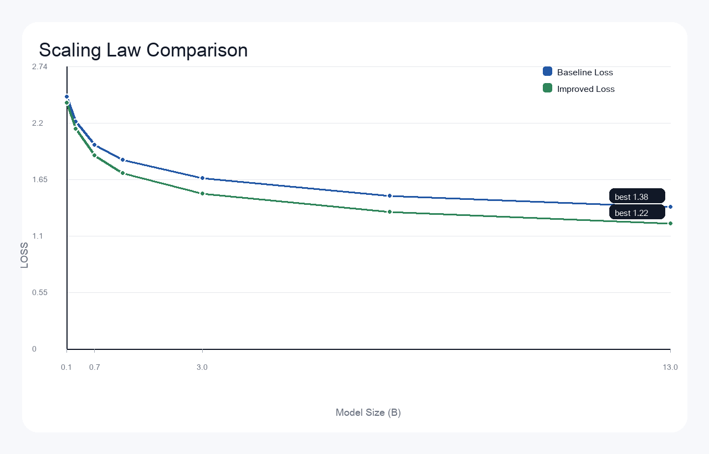
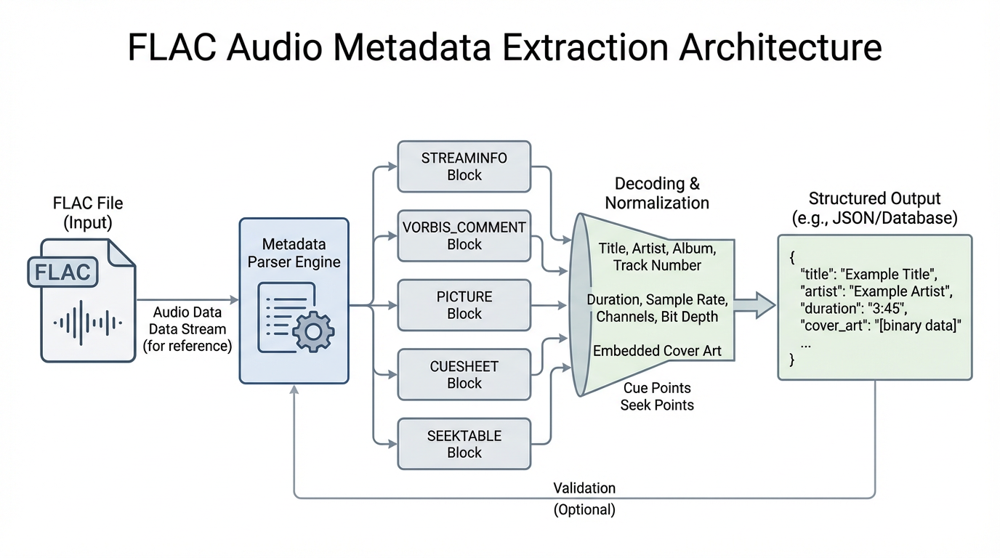
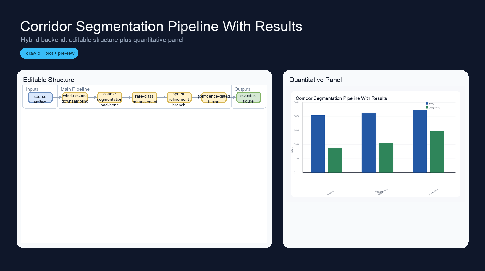
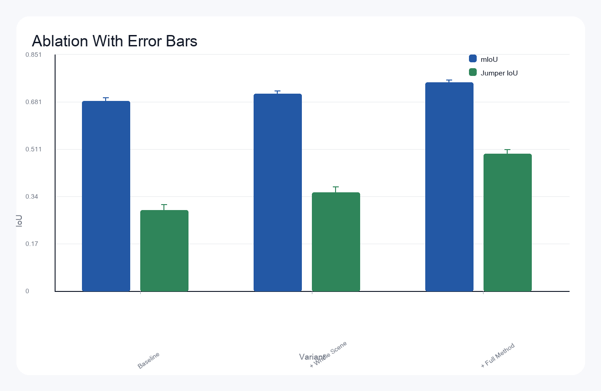
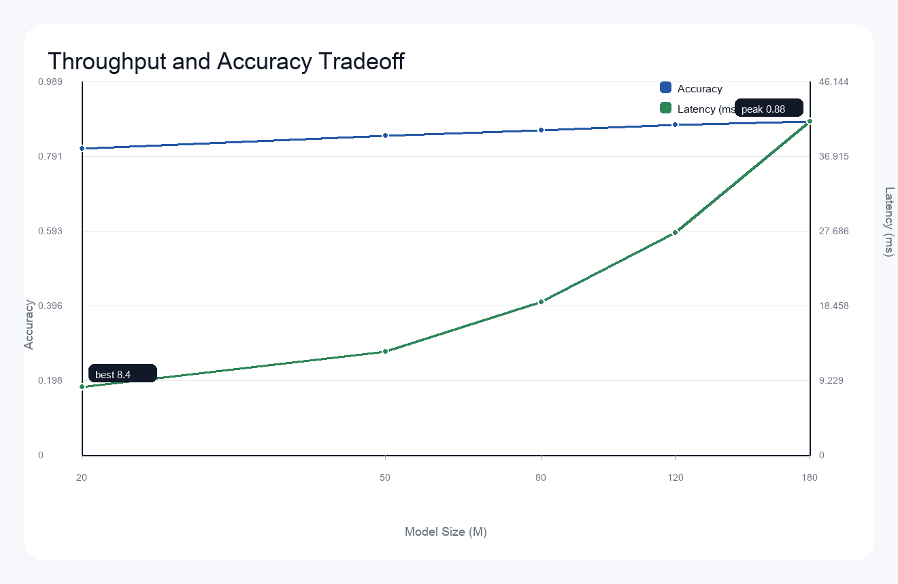

# Research Figures

[](https://github.com/streamer-AP/research-figures/actions/workflows/offline-demo.yml)

Turn paper text, tables, and patent drafts into publication-ready figures in one command.

[Quickstart](docs/QUICKSTART.md) · [Roadmap](ROADMAP.md) · [Contributing](CONTRIBUTING.md) · [Release Notes](docs/release/v0.1.0.md) · [中文](#中文说明)

License: [MIT](LICENSE)



`research-figures` routes each request to the right backend instead of forcing everything through one renderer:

- `drawio` for editable architecture and system diagrams
- `plot` for polished charts from Markdown, CSV, and common LaTeX tables
- `banana` for image-first paper figures and visual abstracts
- `hybrid` for a structure panel plus a quantitative panel in one run

## 60-Second Quickstart

```bash
python3 -m pip install -r requirements.txt
./research-figures demo --offline
```

Generate a custom figure:

```bash
./research-figures \
  --source-file examples/showcase/ml_theory_scaling_law.md \
  --request "generate a scaling law line plot" \
  --output-dir out/demo_plot
```

Generate a real Banana visual abstract when `BANANA_API_KEY` or `API_KEY` is available:

```bash
./research-figures \
  --source-file examples/showcase/cv_multiscale_segmentation_visual.md \
  --request "generate a visual abstract" \
  --backend banana \
  --figure-class visual-abstract \
  --output-dir out/demo_banana
```

Each run writes:

- a figure artifact such as `figure.png`, `figure.svg`, or `figure.drawio`
- `figure.caption.md` for manuscript-ready captions and alt text
- `figure_intent.yaml`, `verification.yaml`, and `bundle.yaml` for reproducibility

## Why This Repo Converts

- One entry point: `./research-figures` works for editable diagrams, plots, image-style figures, and hybrids.
- Fast first success: `./research-figures demo --offline` works without an API key.
- Paper-ready output: the pipeline now emits `figure.caption.md` from the same intent used for rendering.
- Source-aware fallback: when `figure_intent.yaml` is sparse, captions fall back to Markdown sections, bullet lists, and Markdown tables.
- Strong showcase surface: the repo already demonstrates CV, NLP, LLM, ML theory, and audio/system examples.

## Showcase

| Domain | Example | Backend | Preview |
| --- | --- | --- | --- |
| CV | Coarse-to-fine corridor segmentation | banana |  |
| NLP | Document-level information extraction | banana |  |
| LLM | Tool-using agent pipeline | banana |  |
| ML Theory | Scaling law comparison | plot |  |
| Audio / Systems | FLAC metadata extraction overview, plus [editable `.drawio`](docs/assets/drawio_flac_pipeline.drawio) | banana + drawio |  |
| Hybrid | Corridor pipeline plus results | hybrid |  |

## More Examples

| Case | Source | Backend | Preview |
| --- | --- | --- | --- |
| Error-bar ablation chart | [ablation_with_error.md](examples/plot/ablation_with_error.md) | plot |  |
| Dual-axis log-x tradeoff chart | [benchmark_dual_axis.md](examples/plot/benchmark_dual_axis.md) | plot |  |
| Structure + results composite figure | [corridor_results_hybrid.md](examples/hybrid/corridor_results_hybrid.md) | hybrid |  |

## Example Sources By Backend

| Backend | Example Sources |
| --- | --- |
| `drawio` | [flac_metadata_pipeline.md](examples/drawio/flac_metadata_pipeline.md) |
| `banana` | [cv_multiscale_segmentation_visual.md](examples/showcase/cv_multiscale_segmentation_visual.md), [nlp_document_ie.md](examples/showcase/nlp_document_ie.md), [llm_agent_pipeline.md](examples/showcase/llm_agent_pipeline.md) |
| `plot` | [ml_theory_scaling_law.md](examples/showcase/ml_theory_scaling_law.md), [ablation_with_error.md](examples/plot/ablation_with_error.md), [benchmark_dual_axis.md](examples/plot/benchmark_dual_axis.md), [umbrella_hourly_report.tex](examples/plot/umbrella_hourly_report.tex) |
| `hybrid` | [corridor_results_hybrid.md](examples/hybrid/corridor_results_hybrid.md) |

## CLI Surface

The top-level wrapper is intentionally small:

```bash
./research-figures demo --offline
./research-figures --source-file <file> --request "<what to draw>" --output-dir out/run
```

For direct backend control, use the underlying studio pipeline:

```bash
python3 skills/research-figure-studio/scripts/run_figure_pipeline.py \
  --source-file examples/hybrid/corridor_results_hybrid.md \
  --request "generate a hybrid figure with structure and result chart" \
  --output-dir out/hybrid_demo
```

## Repository Docs

- [Quickstart](docs/QUICKSTART.md)
- [Contributing](CONTRIBUTING.md)
- [Roadmap](ROADMAP.md)
- [Release Notes v0.1.0](docs/release/v0.1.0.md)

## Current Limits

- Banana is not suitable for exact topology control.
- The current LaTeX parser is pragmatic and focuses on common `tabular` cases.
- `hybrid` preview images are studio-rendered composites, not direct draw.io bitmap exports.

---

## 中文说明

这是一个面向 GitHub 展示和实际投稿使用的科研绘图仓库：把论文文本、表格和技术说明，转成可以直接放进论文或 README 的科研图。

[快速开始](docs/QUICKSTART.md) · [路线图](ROADMAP.md) · [贡献指南](CONTRIBUTING.md) · [版本说明](docs/release/v0.1.0.md)

### 这个仓库解决什么问题

- `drawio` 负责可编辑结构图
- `plot` 负责 Markdown / CSV / 常见 LaTeX 表格成图
- `banana` 负责论文风 visual abstract 和方法图
- `hybrid` 负责一次输出结构图和结果面板

### 1 分钟试跑

```bash
python3 -m pip install -r requirements.txt
./research-figures demo --offline
```

自定义生成一张图：

```bash
./research-figures \
  --source-file examples/showcase/ml_theory_scaling_law.md \
  --request "generate a scaling law line plot" \
  --output-dir out/demo_plot
```

如果已经配置 `BANANA_API_KEY` 或 `API_KEY`，可以直接生成真实视觉稿：

```bash
./research-figures \
  --source-file examples/showcase/cv_multiscale_segmentation_visual.md \
  --request "generate a visual abstract" \
  --backend banana \
  --figure-class visual-abstract \
  --output-dir out/demo_banana
```

每次运行会同时产出：

- 图文件，如 `figure.png`、`figure.svg`、`figure.drawio`
- `figure.caption.md`，用于论文 caption 和 alt text
- `figure_intent.yaml`、`verification.yaml`、`bundle.yaml`

### 为什么它更容易传播

- 顶层命令统一：`./research-figures`
- 离线可试：不配 API key 也能先跑 plot、drawio、hybrid 和 banana dry-run
- 图和 caption 同步生成，适合论文和 README 一起维护
- showcase 覆盖 CV、NLP、LLM、ML 理论和系统类示例

### 主要展示

| 方向 | 示例 | 后端 | 展示 |
| --- | --- | --- | --- |
| CV | 粗到细走廊点云分割 | banana |  |
| NLP | 文档级信息抽取 | banana |  |
| LLM | 工具调用智能体流程 | banana |  |
| ML 理论 | scaling law 对比图 | plot |  |
| 音频 / 系统 | FLAC 元信息提取，附 [可编辑 `.drawio`](docs/assets/drawio_flac_pipeline.drawio) | banana + drawio |  |
| Hybrid | 结构图 + 结果图 | hybrid |  |

### 仓库文档

- [Quickstart](docs/QUICKSTART.md)
- [Contributing](CONTRIBUTING.md)
- [Roadmap](ROADMAP.md)
- [Release Notes v0.1.0](docs/release/v0.1.0.md)
