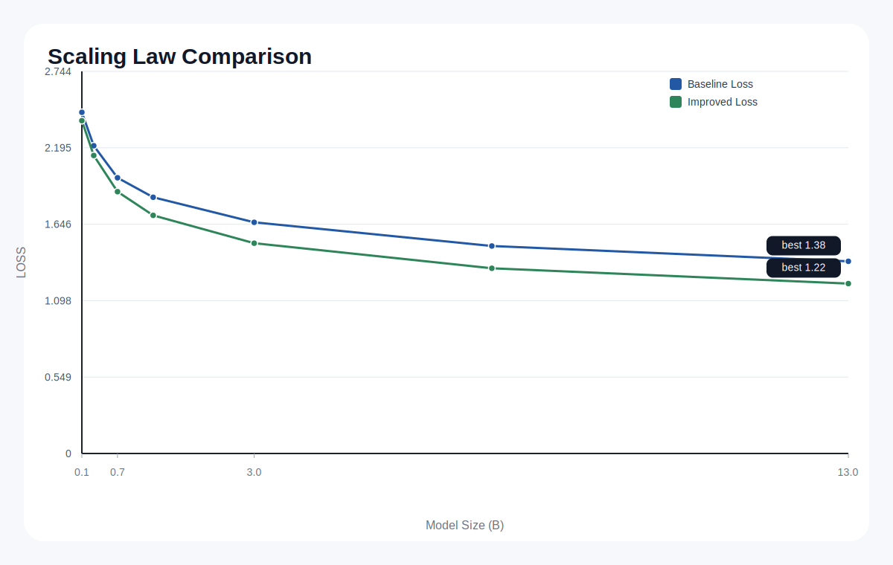

# Research Figure Skills

[中文](#中文说明) | [English](#english)

## English

A routing-first toolkit for scientific figure generation.

License: [MIT](LICENSE)

A single entry point routes requests to the right backend:

- `drawio` for editable structure
- `banana` for image-first paper figures
- `plot` for SVG charts from tables

## Showcase

| Domain | Example | Backend | Preview |
| --- | --- | --- | --- |
| CV | Multi-stage perception / segmentation | drawio | [editable `.drawio`](docs/assets/drawio_flac_pipeline.drawio) |
| NLP | Document-level information extraction | banana |  |
| LLM | Tool-using agent pipeline | banana |  |
| ML Theory | Scaling law comparison | plot |  |
| Audio / Systems | FLAC metadata extraction overview | banana |  |

## What Is Included

| Skill | Purpose | Best For |
| --- | --- | --- |
| `research-figure-studio` | top-level router, intent builder, verifier | one-click scientific figure workflows |
| `drawio-architecture-diagram` | editable `.drawio` generation | architecture diagrams, pipelines, patent structure figures |
| `banana-paper-illustration` | image-first illustration generation | visual abstracts, teaser figures, concept illustrations |

## Repository Layout

```text
research-figure-skills-github/
├── README.md
├── .gitignore
├── docs/
│   └── assets/
├── examples/
│   ├── banana/
│   ├── drawio/
│   └── plot/
└── skills/
    ├── research-figure-studio/
    ├── drawio-architecture-diagram/
    └── banana-paper-illustration/
```

Important:

- keep the three skill folders as siblings under the same `skills/` directory
- `research-figure-studio` expects to find the backend skills next to it

## Quick Start

```bash
python3 skills/research-figure-studio/scripts/run_figure_pipeline.py \
  --source-file examples/showcase/llm_agent_pipeline.md \
  --request "generate an editable architecture diagram" \
  --output-dir out/demo
```

## Current Limits

- `plot` currently targets simple line and grouped-bar charts
- LaTeX parsing is pragmatic and focuses on common `tabular` cases
- Banana is not suitable for exact topology control
- `hybrid` routing is planned but not implemented yet

---

## 中文说明

这是一个“路由优先”的科研绘图工具箱。

统一入口会先判断该走哪类后端：

- `drawio` 负责可编辑结构图
- `banana` 负责论文风图像式配图
- `plot` 负责从表格生成 SVG 图表

## 展示效果

| 方向 | 示例 | 后端 | 展示 |
| --- | --- | --- | --- |
| CV | 多阶段感知 / 分割流程 | drawio | [可编辑 `.drawio`](docs/assets/drawio_flac_pipeline.drawio) |
| NLP | 文档级信息抽取 | banana |  |
| LLM | 工具调用智能体流程 | banana |  |
| ML 理论 | scaling law 对比图 | plot |  |
| 音频 / 系统 | FLAC 元信息提取 | banana |  |

## 包含的 Skill

| Skill | 作用 | 适用场景 |
| --- | --- | --- |
| `research-figure-studio` | 总控路由、意图生成、校验 | 一键科研绘图流程 |
| `drawio-architecture-diagram` | 生成可编辑 `.drawio` | 架构图、流程图、专利结构图 |
| `banana-paper-illustration` | 生成图像式论文配图 | visual abstract、teaser、概念图 |

## 仓库结构

```text
research-figure-skills-github/
├── README.md
├── .gitignore
├── docs/
│   └── assets/
├── examples/
│   ├── banana/
│   ├── drawio/
│   └── plot/
└── skills/
    ├── research-figure-studio/
    ├── drawio-architecture-diagram/
    └── banana-paper-illustration/
```

注意：

- 三个 skill 必须作为同级目录保留在 `skills/` 下
- `research-figure-studio` 会查找旁边的两个后端 skill

## 快速开始

```bash
python3 skills/research-figure-studio/scripts/run_figure_pipeline.py \
  --source-file examples/showcase/llm_agent_pipeline.md \
  --request "generate an editable architecture diagram" \
  --output-dir out/demo
```

## 当前限制

- `plot` 目前只做简单折线图和分组柱状图
- LaTeX 解析是实用型实现，重点支持常见 `tabular`
- Banana 不适合追求像素级结构控制
- `hybrid` 路由目前只有设计，没有实现
