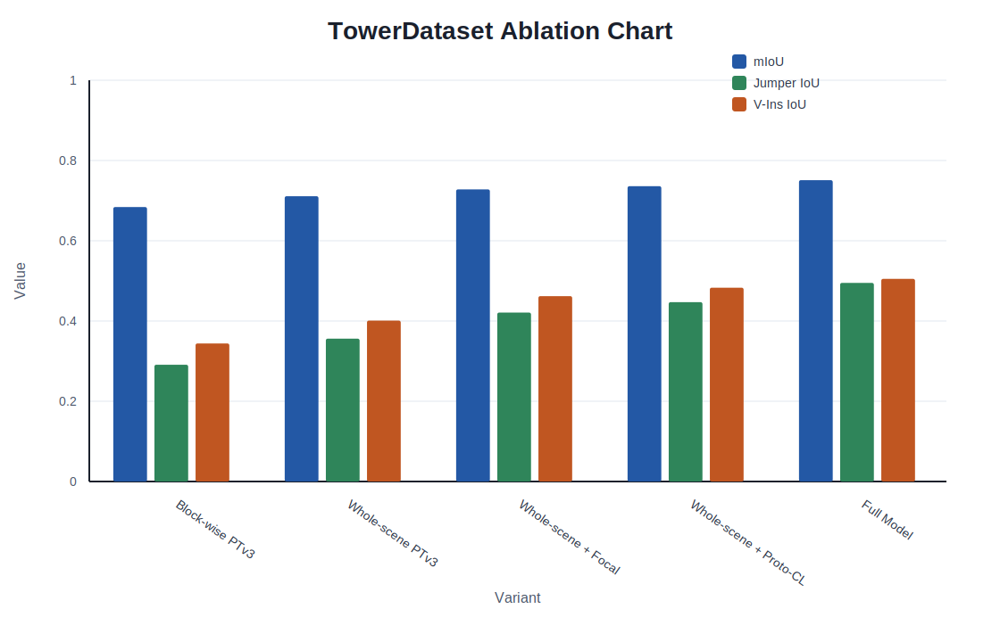

# Research Figure Skills

[中文](#中文说明) | [English](#english)

## English

A GitHub-ready bundle of Codex skills for controllable scientific figure generation.

License: [MIT](LICENSE)

This repo focuses on one practical idea:

- route figure requests to the right backend instead of forcing everything through one renderer

It currently supports:

- editable architecture diagrams via `draw.io`
- image-first paper illustrations via Banana text-to-image
- reproducible SVG plots from Markdown, CSV, and common LaTeX tables

## Showcase

### 1. Banana Paper Illustration

Synthetic public-safe example for a FLAC metadata extraction method overview:


### 2. Plot Backend

SVG chart generated from a synthetic ablation table:



### 3. draw.io Backend

Editable draw.io example generated from a FLAC metadata parsing pipeline:

- [Download `drawio_flac_pipeline.drawio`](docs/assets/drawio_flac_pipeline.drawio)

GitHub does not preview `.drawio` inline, so the editable file is linked instead of embedded.

## What Is Included

| Skill | Purpose | Best For |
| --- | --- | --- |
| `research-figure-studio` | top-level router, intent builder, verifier | one-click scientific figure workflows |
| `drawio-architecture-diagram` | editable `.drawio` generation | architecture diagrams, pipelines, patent structure figures |
| `banana-paper-illustration` | image-first illustration generation | visual abstracts, teaser figures, concept illustrations |

## Repository Layout

```text
research-figure-skills-github/
├── README.md
├── .gitignore
├── docs/
│   └── assets/
├── examples/
│   ├── banana/
│   ├── drawio/
│   └── plot/
└── skills/
    ├── research-figure-studio/
    ├── drawio-architecture-diagram/
    └── banana-paper-illustration/
```

Important:

- keep the three skill folders as siblings under the same `skills/` directory
- `research-figure-studio` expects to find the backend skills next to it

## Quick Start

### Editable Diagram

```bash
python3 skills/research-figure-studio/scripts/run_figure_pipeline.py \
  --source-file examples/drawio/flac_metadata_pipeline.md \
  --request "generate an editable architecture diagram" \
  --output-dir out/drawio_demo
```

### Plot

```bash
python3 skills/research-figure-studio/scripts/run_figure_pipeline.py \
  --source-file examples/plot/ablation_table.md \
  --request "generate an ablation bar chart" \
  --output-dir out/plot_demo
```

### LaTeX Table To Plot

```bash
python3 skills/research-figure-studio/scripts/run_figure_pipeline.py \
  --source-file examples/plot/umbrella_hourly_report.tex \
  --request "generate hourly max umbrella count line plot" \
  --output-dir out/plot_tex_demo
```

### Banana Illustration

```bash
export API_KEY="your-key-here"

python3 skills/banana-paper-illustration/scripts/generate_banana_illustration.py \
  --source-file examples/banana/flac_metadata_method_overview.md \
  --mode method-overview \
  --output out/flac_metadata_overview.png
```

## Security And Publishing Rules

- no API keys are stored in source files
- secrets must come from environment variables only
- no generated private figures should be committed
- no local shell config or machine-specific paths should be required

Before publishing:

1. review `examples/` and `docs/assets/`
2. verify Git history does not contain temporary secrets

## Current Limits

- `plot` currently targets simple line and grouped-bar charts
- LaTeX parsing is pragmatic and focuses on common `tabular` cases
- Banana is not suitable for exact topology control
- `hybrid` routing is planned but not implemented yet

---

## 中文说明

这是一个面向 GitHub 发布的科研绘图 Codex skills 集合，核心目标不是“单一 prompt 出图”，而是把科研绘图拆成可控的四步：

- 路由：先判断该走 `drawio`、`plot` 还是 `banana`
- 意图：把长篇论文/方案压缩成统一的 `figure_intent.yaml`
- 渲染：交给最合适的后端
- 校验：在结果落盘前拦截错误后端和弱结构输入

当前支持三类能力：

- `draw.io` 可编辑架构图
- Banana 图像式论文配图
- 从 Markdown / CSV / 常见 LaTeX 表格生成 SVG 图表

## 展示效果

### 1. Banana 论文风方法图

这是一个公开安全的合成示例，主题是 FLAC 音频元信息提取：


### 2. Plot 后端

这是从合成 ablation 表格生成的 SVG 图表：


### 3. draw.io 后端

这是从 FLAC 元信息解析流程生成的可编辑 `.drawio` 文件：

- [下载 `drawio_flac_pipeline.drawio`](docs/assets/drawio_flac_pipeline.drawio)

由于 GitHub 不能直接内嵌预览 `.drawio`，这里保留可下载的源文件。

## 包含的 Skill

| Skill | 作用 | 适用场景 |
| --- | --- | --- |
| `research-figure-studio` | 总控路由、意图生成、校验 | 一键科研绘图流程 |
| `drawio-architecture-diagram` | 生成可编辑 `.drawio` | 架构图、流程图、专利结构图 |
| `banana-paper-illustration` | 生成图像式论文配图 | visual abstract、teaser、概念图 |

## 仓库结构

```text
research-figure-skills-github/
├── README.md
├── .gitignore
├── docs/
│   └── assets/
├── examples/
│   ├── banana/
│   ├── drawio/
│   └── plot/
└── skills/
    ├── research-figure-studio/
    ├── drawio-architecture-diagram/
    └── banana-paper-illustration/
```

注意：

- 三个 skill 必须作为同级目录保留在 `skills/` 下
- `research-figure-studio` 会查找旁边的两个后端 skill

## 快速开始

### 可编辑架构图

```bash
python3 skills/research-figure-studio/scripts/run_figure_pipeline.py \
  --source-file examples/drawio/flac_metadata_pipeline.md \
  --request "generate an editable architecture diagram" \
  --output-dir out/drawio_demo
```

### 图表

```bash
python3 skills/research-figure-studio/scripts/run_figure_pipeline.py \
  --source-file examples/plot/ablation_table.md \
  --request "generate an ablation bar chart" \
  --output-dir out/plot_demo
```

### LaTeX 表格转图

```bash
python3 skills/research-figure-studio/scripts/run_figure_pipeline.py \
  --source-file examples/plot/umbrella_hourly_report.tex \
  --request "generate hourly max umbrella count line plot" \
  --output-dir out/plot_tex_demo
```

### Banana 图像式配图

```bash
export API_KEY="your-key-here"

python3 skills/banana-paper-illustration/scripts/generate_banana_illustration.py \
  --source-file examples/banana/flac_metadata_method_overview.md \
  --mode method-overview \
  --output out/flac_metadata_overview.png
```

## 安全与公开发布规则

- 不在仓库里存放 API key
- secret 只从环境变量读取
- 不提交私有文档生成的图
- 不依赖本地 shell 配置或机器专属路径

建议发布前检查：

1. `examples/` 和 `docs/assets/` 是否都可公开
2. Git 历史里是否曾提交过临时 key

## 当前限制

- `plot` 目前只做简单折线图和分组柱状图
- LaTeX 解析是实用型实现，重点支持常见 `tabular`
- Banana 不适合追求像素级结构控制
- `hybrid` 路由目前只有设计，没有实现

## 推荐的 GitHub 定位

这个仓库比较适合包装成：

- 一个可控的科研绘图工具箱
- 一个“路由优先”的 figure generation workflow
- 一个连接论文文本、可编辑架构图、图表和图像式配图的实用套件
